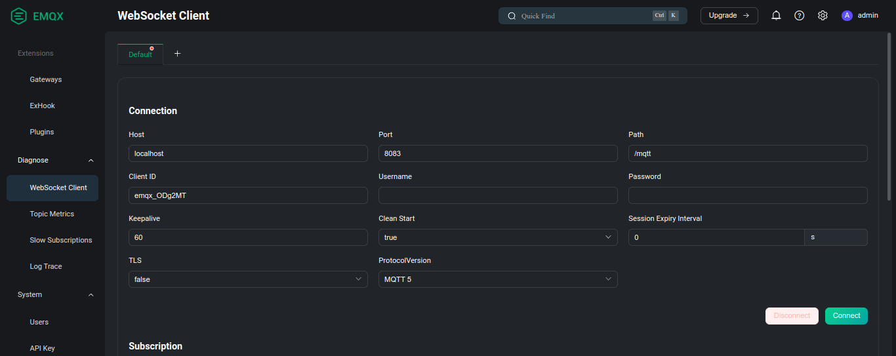
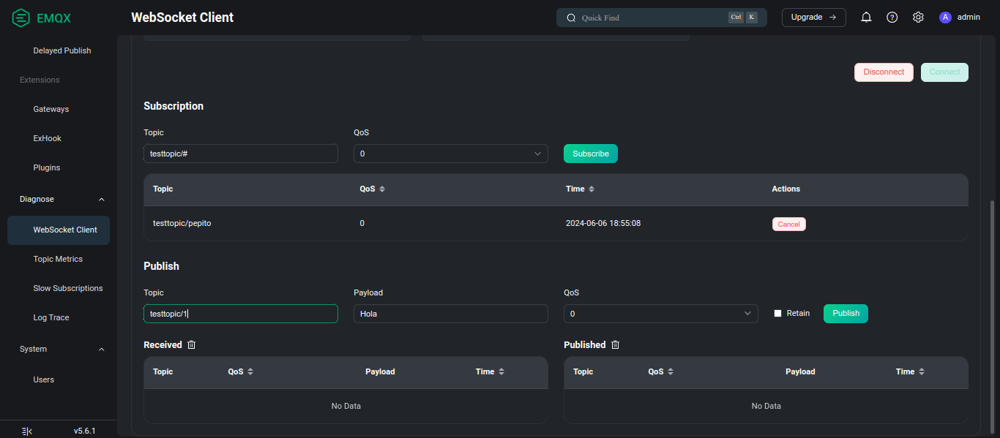

# Tutorial
- [Instalación](#instalación)
  - [Windows](#windows)
  - [Linux](#linux)
  - [Mac](#mac)
- [Ejecución del servidor MQTT](#ejecución-del-servidor-mqtt)
- [Primeros Pasos](#primeros-pasos)

## Instalación

### Windows
La instalación en windows se realiza a través de un archivo .zip, el cual se puede [descargar](https://docs.emqx.com/en/emqx/v5.0/deploy/install-windows.html) de la página de EMQX. Cuando se haya descargado el archivo se debe extraer y acceder a la carpeta, abrir una consola y ejecutar la siguiente línea.

`./bin/emqx start`

### Linux
#### Debian/Ubuntu
Seguir el [tutorial](https://docs.emqx.com/en/emqx/latest/deploy/install-debian.html) de la página de EMQX.

#### Arch
En Arch Linux la instalación se puede realizar a través de Snap, pero recomiendo utilizar la [AUR](https://aur.archlinux.org/) (Arch User Repository).

`yay -S emqx-git`

Para realizar la instalación se puede utilizar el [helper](https://wiki.archlinux.org/title/AUR_helpers) a elección.

#### Fedora
Para realizar la instalación se debe utilizar Snap, sistema de gestión de paquetes universales. El comando es el presentado a continuación:

`sudo snap install emqx`

### MacOS
Para realizar la instalación seguir el siguiente tutorial [Install EMQX on macOS](https://docs.emqx.com/en/emqx/latest/deploy/install-macOS.html)

## Ejecución del servidor MQTT
El servidor MQTT se ejecuta en `http://localhost:18083/`. En el caso de este proyecto, no es necesario habilitar puertos internos en Raspberry.

Se requiere la apertura de puertos en caso de que se utilice una PC como Host, y se quiera acceder a ese servidor a través de otra PC, ESP o aplicación de mobil.

## Primeros Pasos

### Linux
1. Iniciar servicio EMQX.

`systemctl emqx.service`

2. Iniciar EMQX

`emqx start`

En caso de que arroje error probar con:

`sudo emqx start`

3. Iniciar broker (web socket client connect).

4. agregar topico en "WebSocket Client"

5. habilitar puerto 1883 "sudo ufw allow 1883". Esto para el caso donde se utilice la PC como Host. El puerto puede variar en cada dispositivo.

